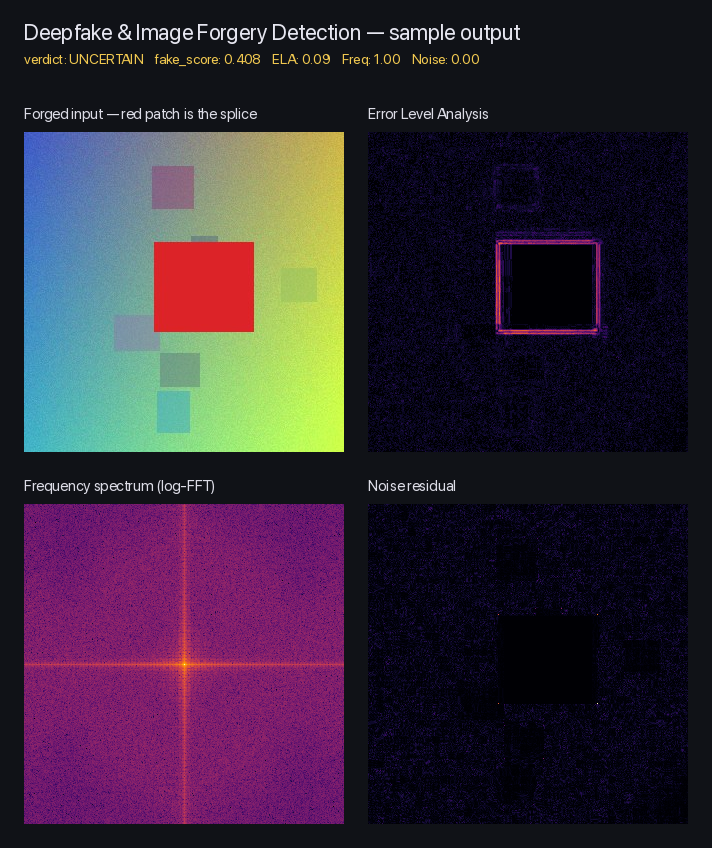

# Deepfake & Image Forgery Detection

[](https://www.python.org/downloads/)
[](https://pytorch.org/)
[](https://docs.astral.sh/uv/)

An **explainable** detector for AI-generated and tampered images. Instead of
producing a single black-box score, it fuses a deep-learning classifier with
classical media-forensics signals (Error Level Analysis, frequency-domain
analysis, noise residual, EXIF inspection) so you can see *which* signals
fired and *why* — and treat the result as evidence rather than an oracle.



> Above: a synthetic splice (the red rectangle) is detected by Error Level
> Analysis — the red border in the top-right panel traces the edited region.
> Reproduce with `uv run python scripts/make_demo.py`.

Ships with:

- A **CLI** — `detect`, `batch`, `train`, `evaluate`
- A **Gradio web demo** — drag-and-drop UI with side-by-side heatmaps
- A **trainable CNN** — small CIFAR-style ResNet that benchmarks at **94.5% accuracy / 0.988 AUC** on CIFAKE in a few minutes on CPU
- A **library API** — `DetectionPipeline().analyze(...)` returning a structured, JSON-serializable report

---

## Results

Trained on [CIFAKE](https://huggingface.co/datasets/dragonintelligence/CIFAKE-image-dataset)
(60k real CIFAR-10 + 60k Stable-Diffusion images, 32×32) for 5 epochs on CPU
in ~5 minutes. Evaluated on the 20k-image test split.

| Method                 | N      | Accuracy | Precision | Recall | F1     | AUC    |
|------------------------|--------|----------|-----------|--------|--------|--------|
| **Trained CNN**        | 20,000 | **0.9451** | 0.9330  | 0.9591 | 0.9459 | **0.9877** |
| Forensics pipeline     | 1,000  | 0.6990   | 0.6492    | 0.8054 | 0.7190 | 0.8036 |

The trained CNN handily beats the heuristic baseline; the forensics pipeline
is included as an explainable, model-free fallback that still clears 0.80 AUC
without a single training step.

---

## How it works

The detection pipeline combines **five independent signals**, each capturing
a different failure mode of forged or generated images:

| Signal | Catches | Module |
|---|---|---|
| **ML classifier** | GAN/diffusion-style synthesis | [`classifier.py`](src/deepfake_detection/classifier.py) — HuggingFace SigLIP detector, swappable via `DEEPFAKE_MODEL_ID` |
| **Error Level Analysis (ELA)** | Splices, local edits, copy-paste forgery | [`forensics.py`](src/deepfake_detection/forensics.py) |
| **Frequency analysis** | GAN/diffusion spectral fingerprints | [`forensics.py`](src/deepfake_detection/forensics.py) |
| **Noise residual** | Composited regions with mismatched sensor noise | [`forensics.py`](src/deepfake_detection/forensics.py) |
| **EXIF metadata** | Stripped EXIF, AI-generator software tags | [`metadata.py`](src/deepfake_detection/metadata.py) |

The five signals are fused into a single `fake_score ∈ [0, 1]` via a weighted
sum (see `_WEIGHTS` in [`pipeline.py`](src/deepfake_detection/pipeline.py)).
Every detection report carries the full per-signal breakdown so you can audit
*which* signal fired — and the Gradio UI renders the ELA, FFT, and noise
heatmaps side-by-side so you can see *where* on the image they fired.

---

## Quickstart

Requires Python 3.12 and [`uv`](https://docs.astral.sh/uv/).

```bash
git clone https://github.com/praysimanjuntak/deepfake-detection.git
cd deepfake-detection
uv sync
```

The first ML inference downloads the pretrained model from HuggingFace
(~400 MB). Pass `--no-model` to any CLI command, or use
`DetectionPipeline.forensics_only()`, to skip that.

---

## Usage

### CLI

```bash
# Single image — pretty-printed verdict + per-signal breakdown
uv run deepfake-detection detect path/to/image.jpg

# Forensics-only (no model download)
uv run deepfake-detection detect path/to/image.jpg --no-model

# Machine-readable JSON
uv run deepfake-detection detect path/to/image.jpg --json

# Batch a folder, write JSON-lines report
uv run deepfake-detection batch ./samples --out report.jsonl
```

### Web demo

```bash
uv run deepfake-detection-app
```

Opens a Gradio UI: drop an image, see the verdict, fake-score breakdown,
ELA heatmap, FFT spectrum, and noise-residual map side by side.

### Library

```python
from deepfake_detection import DetectionPipeline

pipeline = DetectionPipeline()
report = pipeline.analyze("photo.jpg")

print(report.verdict, report.fake_score)         # "fake" 0.873
for name, score in report.signal_scores.items():
    print(f"  {name}: {score:.3f}")
# Full structured report:
report.to_dict()
```

---

## Training a custom model

The repo includes a small ResNet-style CNN (~270k params) and a CIFAKE
loader so you can train and benchmark a custom detector against the
forensics pipeline.

```bash
# Quick smoke test (~30s on CPU)
uv run deepfake-detection train --epochs 2 --subset 5000

# Full run (~5 minutes on CPU, full 100k training set)
uv run deepfake-detection train --epochs 5

# Benchmark trained CNN vs. forensics pipeline on the same test split
uv run deepfake-detection evaluate --pipeline-limit 1000
```

CIFAKE is downloaded automatically (~50 MB) on first run.

> **Note on Apple Silicon:** training defaults to CPU. PyTorch's MPS backend
> has been observed corrupting normalization parameters into NaN on small
> networks; the model uses GroupNorm to be safe and CPU is fast enough at
> this scale. Pass `--device mps` to opt in, or `--device cuda` if you have
> an Nvidia GPU.

---

## Project structure

```
src/deepfake_detection/
├── __init__.py       # public API
├── classifier.py     # pretrained HuggingFace classifier wrapper
├── forensics.py      # ELA, FFT, noise residual
├── metadata.py       # EXIF inspection
├── pipeline.py       # fuses signals into a DetectionReport
├── cifake.py         # CIFAKE loader (HF datasets → torch DataLoaders)
├── model.py          # SmallResNet — CIFAR-style net for 32x32
├── training.py       # train loop + checkpoint helpers
├── evaluation.py     # benchmark harness (CNN vs. forensics pipeline)
├── cli.py            # `deepfake-detection` CLI
└── app.py            # `deepfake-detection-app` Gradio demo
```

---

## Tests

```bash
uv run pytest
```

The tests are deliberately **shape- and range-only** — they catch regressions
without baking in heuristic-specific numbers that would make the suite brittle.

---

## Caveats

- **No single signal is bulletproof.** Frequency artifacts fade with
  downscaling and JPEG re-encoding; ELA is noisy on already-recompressed
  images; missing EXIF doesn't prove forgery. The combined score is a
  prior, not a verdict.
- The default pretrained classifier was trained on a face-centric
  distribution. For document, screenshot, or scene forgery the
  classical-forensics signals matter much more.
- The trained CNN was benchmarked on CIFAKE only — generalization to other
  generators (Midjourney, FLUX, Imagen) is an open question. A
  cross-dataset evaluation (e.g. against [GenImage](https://genimage-dataset.github.io/))
  is the natural next step.

---

## Roadmap

- [ ] Cross-dataset evaluation (train on CIFAKE → test on GenImage / Artifact)
- [ ] Stronger backbone (EfficientNet-B0 / ConvNeXt-Tiny) at full resolution
- [ ] Test-time augmentation
- [ ] Per-signal calibration via held-out validation set
- [ ] Localization heatmap from the trained CNN (Grad-CAM)
